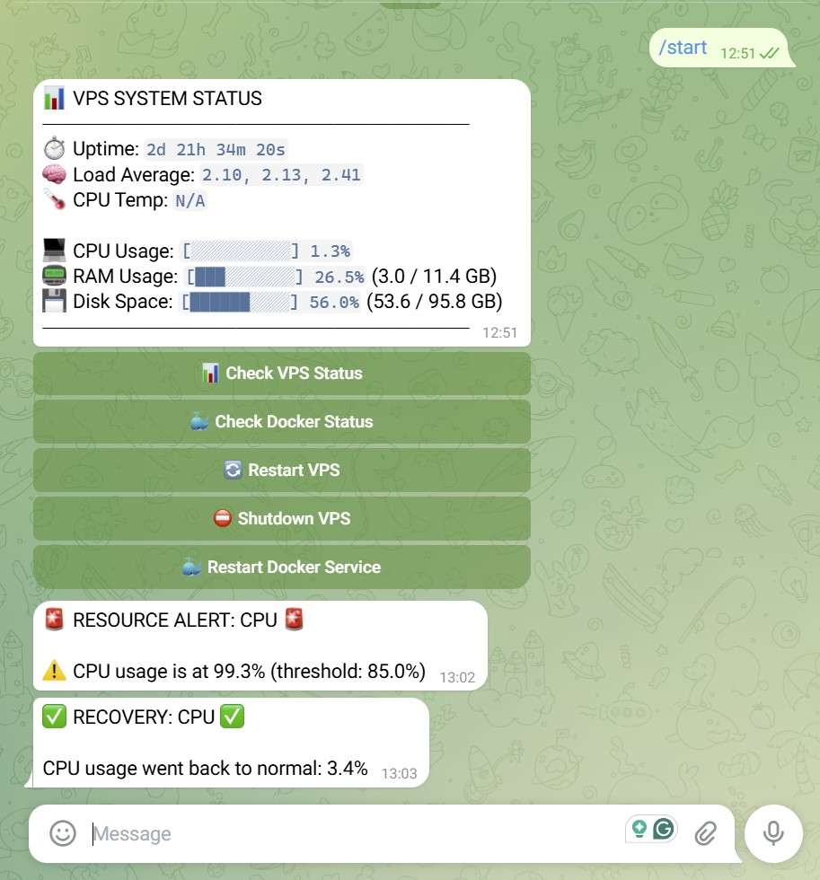

# VPS Resource Monitoring Bot (Docker Optimized)

Lightweight server resource monitoring system packaged as a Docker container, controlled via a Telegram Bot.

<p align="center">
  
</p>

## Features
- **🖥 Multi-server UI**: Telegram starts with a server list (`MY107`, `MYOR`); each server opens the control panel. Last selected server is restored on `/start`.
- **📊 Real-time Monitoring**: Track CPU, RAM, Disk space, Load Average, CPU Temperature, and System Uptime (local mounts on MY107, SSH collector on MYOR).
- **🚨 Smart Notifications**: Alerts on high CPU/RAM/Disk usage with per-server labels, recovery detection, and anti-spam cooldowns.
- **🔄 Remote VPS Management** (scoped to the selected server):
  - `Restart VPS` / `Shutdown VPS` / `Restart Docker`
  - `Check Status` / `Check Docker Status`
- **🔐 Secure Access**: Strictly limits command execution and monitoring reports to authorized Telegram user/chat IDs.
- **🐳 Optimized Dockerization**: Extremely small memory footprint (runs under Python 3.11-slim) and accesses the host OS namespace directly.

---

## Architecture (Docker-to-Host)

Inside a Docker container, standard tools inspect container-specific memory/CPU quotas rather than the VPS itself. To monitor and control the host VPS from within Docker, this application uses:
1. **`PROCFS_PATH=/host/proc`**: Points Python `psutil` to the host's `/proc` directory, allowing it to collect host metrics.
2. **Host Volumes**: 
   - `/proc` mounted to `/host/proc` (read-only)
   - `/sys` mounted to `/host/sys` (read-only)
   - `/` mounted to `/host/root` (read-write)
3. **`chroot`**: Commands like reboot, shutdown, or systemctl are piped to the host via `chroot /host/root <command>`, ensuring they run within the host's operating system namespace.
4. **`privileged: true`**: Needed by the Docker engine to permit the container to run `chroot` commands and send power signals.

---

## Getting Started

### 1. Create a Telegram Bot
1. Open Telegram and search for [@BotFather](https://t.me/BotFather).
2. Send `/newbot` and follow the instructions to get your **Bot Token**.
3. To find your **Telegram Chat ID**, send a message to your new bot, then open `https://api.telegram.org/bot<YOUR_BOT_TOKEN>/getUpdates` in a browser or search for [@userinfobot](https://t.me/userinfobot) to get your numerical ID.

### 2. Configure Environment Variables
You can configure the application in one of two ways:

#### Option A: Portainer Stack (Recommended)
When creating a Stack in Portainer:
1. Paste the contents of `docker-compose.yml`.
2. Under **Environment variables**, click **Add environment variable** and specify the following:
   * `TELEGRAM_BOT_TOKEN`: Your bot token.
   * `ALLOWED_CHAT_IDS`: Comma-separated allowed chat IDs (e.g., `123456789`).
   * `SERVERS` (optional): `MY107|local,MYOR|ssh|opc@92.5.8.212:22|/keys/id_ed25519_monitor_myor`
   * `CPU_THRESHOLD` (optional, defaults to `85`)
   * `RAM_THRESHOLD` (optional, defaults to `85`)
   * `DISK_THRESHOLD` (optional, defaults to `90`)
   * `CHECK_INTERVAL` (optional, defaults to `60`)
   * `ALERT_COOLDOWN` (optional, defaults to `1800`)
   * `CPU_ALERT_DELAY` (optional, delay in seconds before alerting on high CPU, defaults to `300` / 5 minutes)
   * `RAM_ALERT_DELAY` (optional, delay in seconds before alerting on high RAM, defaults to `300` / 5 minutes)

#### Option B: Manual Docker Compose (Using `.env` file)
Copy `.env.example` to `.env` in the same directory:
```bash
cp .env.example .env
```
Open `.env` and fill in your details:
```env
TELEGRAM_BOT_TOKEN=your_bot_token_here
ALLOWED_CHAT_IDS=your_chat_id_here
```

### 3. Deploy
* **Portainer**: Click **Deploy the stack**.
* **CLI**: Build and run using:
  ```bash
  docker compose up -d --build
  ```

---

## Telegram Bot Command Reference
- `/start` - Server list, or last selected server panel (remembered per chat).
- `/status` - Prints resource usage for the last selected server.

**Server list:**
- **🖥 MY107** / **🖥 MYOR** — open that server's control panel.

**Control Buttons (per server):**
- **📊 Check VPS Status**: Updates resource monitoring stats.
- **🐳 Check Docker Status**: Outputs a list of active Docker containers on the host (like `docker ps`).
- **🔄 Restart VPS**: Prompts with confirmation dialog, then reboots the VPS.
- **⛔ Shutdown VPS**: Prompts with confirmation dialog, then shuts down the VPS.
- **🐳 Restart Docker Service**: Prompts with confirmation dialog, then restarts the host's Docker daemon.
- **⬅️ Servers**: Back to the server list.

### Deploy notes (MY107 bot + MYOR via SSH)
1. Public key `monitor-sys-myor` must be in `opc@MYOR:~/.ssh/authorized_keys`.
2. Private key must be on MY107 at `/root/.ssh/id_ed25519_monitor_myor` (mounted into the container as `/keys/id_ed25519_monitor_myor`).
3. Local copy of the key pair lives under `secrets/` (gitignored) until you deploy.

---

## Security Warnings

> [!CAUTION]
> **Privileged Container**
> Because this container is configured with `privileged: true` and mounts the host `/` root filesystem, anyone who gains write access to this container or bot token can fully control the host system.
> Keep your **Telegram Bot Token** extremely private and verify that your `ALLOWED_CHAT_IDS` are correct!

> [!WARNING]
> **Docker Daemon Restart behavior**
> When you click **Restart Docker**, the Docker service on the host will be restarted. This will stop this container and all other containers running on the host. Make sure this container has a restart policy like `restart: unless-stopped` or `restart: always` (which is already configured in `docker-compose.yml`) so that it starts back up once the Docker daemon is online.
